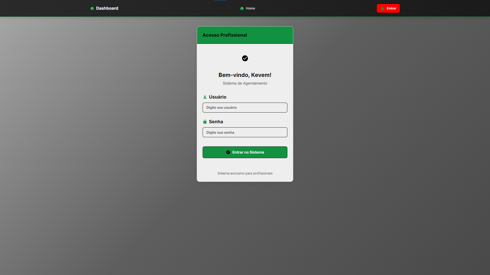
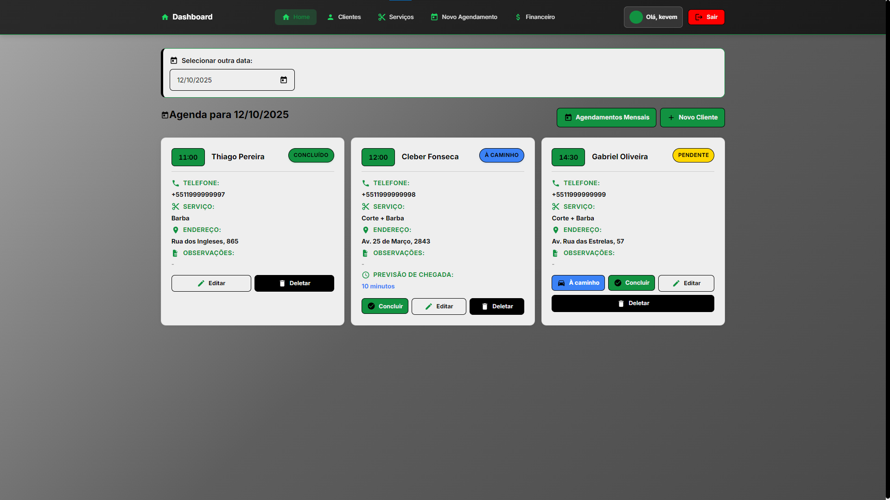
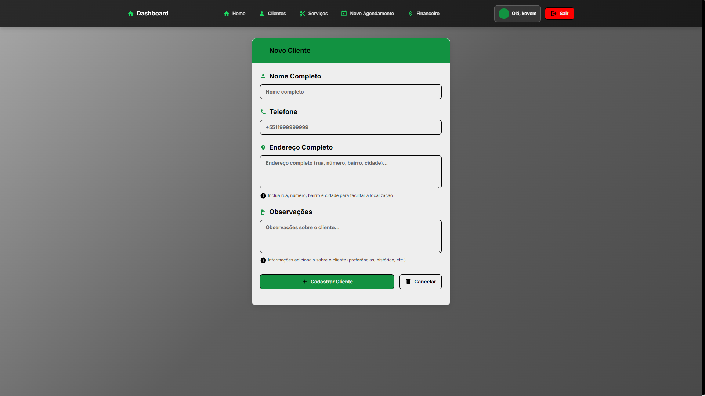
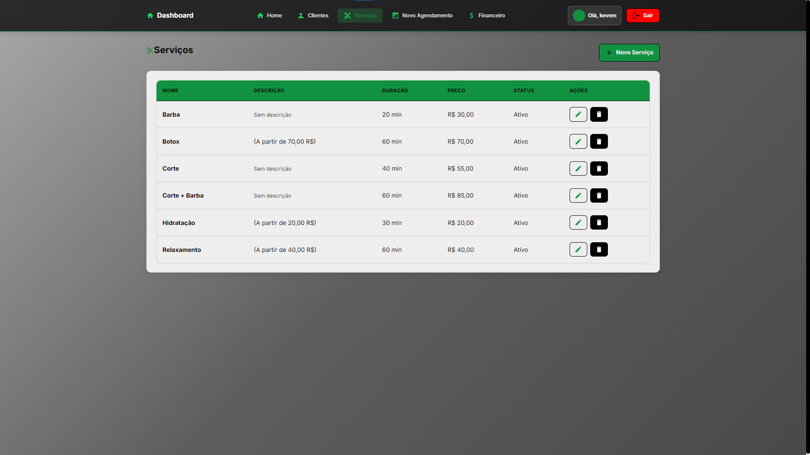
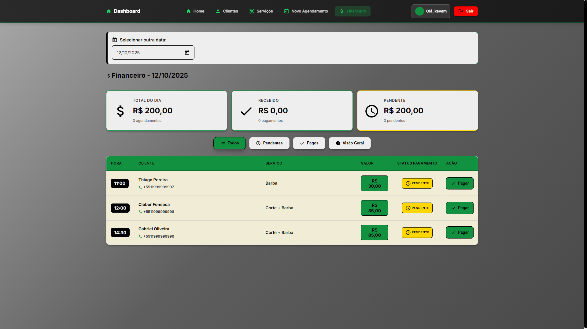
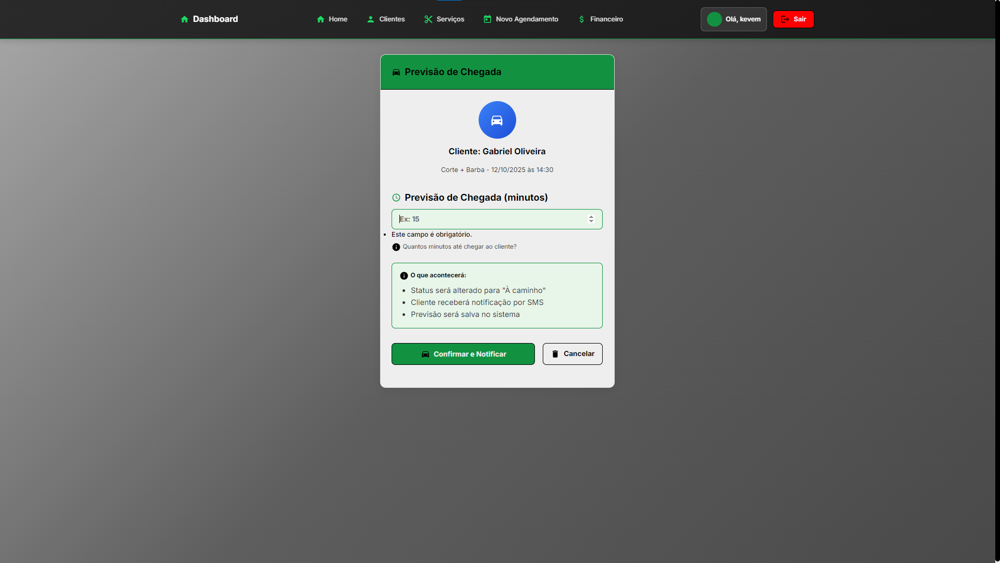
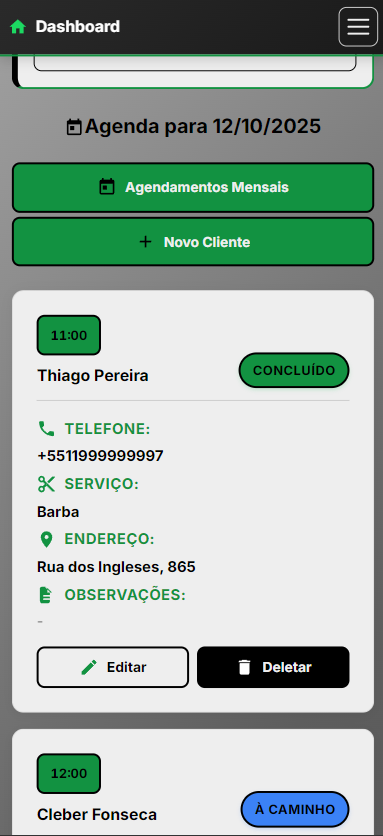

# 💇‍♂️ Sistema de Agendamento para Barbearia


---

## 📑 Índice

- [Sobre o Projeto](#-sobre-o-projeto)
- [Funcionalidades](#-funcionalidades)
- [Tecnologias Utilizadas](#-tecnologias-utilizadas)
- [Instalação](#-instalação)
- [Configuração](#️-configuração)
- [Como Usar](#-como-usar)
- [Screenshots](#-screenshots)
- [Interface](#-interface)
- [Segurança](#-segurança)
- [Melhorias Futuras](#-melhorias-futuras)
- [Sistema em Produção](#-sistema-em-produção)
- [Contribuição](#-contribuição)
- [Licença](#-licença)
- [Desenvolvedor](#-desenvolvedor)

---

## 📋 Sobre o Projeto

Sistema completo de agendamento para barbearia desenvolvido em Django, com funcionalidades avançadas de gestão de clientes, serviços, agendamentos e notificações por SMS. Ideal para barbearias que desejam modernizar seu atendimento e melhorar a experiência do cliente.

## ✨ Funcionalidades

### 🎯 Gestão de Agendamentos

- ✅ Cadastro e edição de agendamentos
- ✅ Visualização por data com calendário
- ✅ Status em tempo real (Agendado, Confirmado, À caminho, Concluído)
- ✅ Previsão de chegada do barbeiro
- ✅ Histórico completo de atendimentos

### 👥 Gestão de Clientes

- ✅ Cadastro completo de clientes
- ✅ Informações de contato e endereço
- ✅ Histórico de serviços realizados
- ✅ Busca e filtros avançados

### 💼 Gestão de Serviços

- ✅ Cadastro de serviços oferecidos
- ✅ Definição de preços
- ✅ Tempo estimado por serviço
- ✅ Categorização de serviços

### 📱 Notificações por SMS

- ✅ Integração com SMSDev (API brasileira)
- ✅ Notificação automática "barbeiro a caminho"
- ✅ Previsão de chegada personalizada
- ✅ Logs detalhados de envio

### 📊 Relatórios Financeiros

- ✅ Relatório mensal de faturamento
- ✅ Análise por serviço
- ✅ Controle de pagamentos
- ✅ Exportação de dados

### 🔐 Sistema de Autenticação

- ✅ Login seguro para barbeiros
- ✅ Controle de acesso
- ✅ Sessões seguras

## 🚀 Tecnologias Utilizadas

- **Backend:** Django 5.2.7, Python 3.12
- **Frontend:** HTML5, CSS3, JavaScript
- **Banco de Dados:** SQLite (desenvolvimento) / PostgreSQL (produção)
- **SMS:** SMSDev API
- **Autenticação:** Django Auth System
- **Deploy:** Railway (https://railway.app)
- **Servidor:** Gunicorn
- **Assets:** WhiteNoise (arquivos estáticos)
- **Testes:** Django TestCase, pytest, coverage.py
- **Qualidade:** Mock/Patch para simulação de APIs

## 📦 Instalação

### Pré-requisitos

- Python 3.8+
- pip
- Git

### Passo a Passo

1. **Clone o repositório**

```bash
git clone https://github.com/notdougz/projeto-barbeiro.git
cd projeto-barbeiro
```

2. **Crie e ative o ambiente virtual**

```bash
python -m venv venv
# Windows
venv\Scripts\activate
# Linux/Mac
source venv/bin/activate
```

3. **Instale as dependências**

```bash
pip install -r requirements.txt
```

4. **Configure as variáveis de ambiente**

```bash
cp env_example.txt .env
# Edite o arquivo .env com suas configurações
```

5. **Execute as migrações**

```bash
python manage.py migrate
```

6. **Crie um superusuário**

```bash
python manage.py createsuperuser
```

7. **Inicie o servidor**

```bash
python manage.py runserver
```

8. **Execute os testes (opcional)**

```bash
# Executar testes básicos
python manage.py test

# Ou com pytest
pytest

# Com relatório de cobertura
coverage run --source='.' manage.py test
coverage html
```

## ⚙️ Configuração

### Configuração do SMS

1. **Cadastre-se no SMSDev:** https://app.smsdev.com.br
2. **Obtenha suas credenciais** no painel da API
3. **Configure no arquivo .env:**

```env
SMS_ENABLED=True
SMSDEV_USUARIO=seu_email@exemplo.com
SMSDEV_TOKEN=sua_chave_token
```

### Configuração para Produção

Para instruções detalhadas de deploy, consulte o arquivo [DEPLOY_GUIDE.md](DEPLOY_GUIDE.md).

#### Deploy no Railway

1. **Crie uma conta no Railway:** https://railway.app
2. **Conecte seu repositório GitHub**
3. **Configure as variáveis de ambiente:**
   - `SECRET_KEY`: Chave secreta do Django
   - `DEBUG`: False
   - `ALLOWED_HOSTS`: seu-dominio.up.railway.app
   - `SMSDEV_USUARIO`: seu email do SMSDev
   - `SMSDEV_TOKEN`: seu token do SMSDev
   - `SMS_ENABLED`: True
4. **Railway detectará automaticamente** o Procfile e requirements.txt
5. **Seu site estará no ar!**

#### Configuração Alternativa (VPS/Servidor Próprio)

1. **Configure o banco de dados PostgreSQL**
2. **Configure variáveis de ambiente de produção**
3. **Configure servidor web (Nginx + Gunicorn)**
4. **Configure SSL/HTTPS com Let's Encrypt**
5. **Configure domínio personalizado**

## 📱 Como Usar

### Para Barbeiros

1. **Faça login** no sistema
2. **Visualize agendamentos** do dia
3. **Confirme atendimentos** quando necessário
4. **Marque "À caminho"** para enviar SMS automático
5. **Conclua atendimentos** após finalização

## 📸 Screenshots

### Tela de Login



> Interface moderna e responsiva para acesso ao sistema

### Painel Principal (Dashboard)



> Visão geral dos agendamentos com calendário interativo

### Lista de Agendamentos


> Gerenciamento completo de agendamentos com filtros e status em tempo real

### Cadastro de Cliente



> Formulário completo para cadastro de novos clientes

### Lista de Clientes


> Visualização e busca de clientes cadastrados

### Gerenciamento de Serviços



> Cadastro e controle dos serviços oferecidos pela barbearia

### Relatório Financeiro



> Dashboard com análise de faturamento mensal

### Previsão de Chegada



> Sistema de notificação com previsão de chegada do barbeiro

### Interface Mobile



> Sistema totalmente responsivo para dispositivos móveis

## 🎨 Interface

### Painel Principal

- Calendário interativo
- Lista de agendamentos do dia
- Status visual dos atendimentos
- Botões de ação rápida

### Gestão de Clientes

- Formulário completo de cadastro
- Lista paginada com busca
- Histórico de serviços
- Edição e exclusão segura

### Relatórios

- Dashboard financeiro
- Gráficos de faturamento
- Análise por período
- Exportação de dados

## 🧪 Testes Automatizados

### ✅ Cobertura de Testes

O projeto possui uma **suíte completa de testes automatizados** com **65% de cobertura de código**, garantindo qualidade e confiabilidade do sistema.

### 🔧 Ferramentas de Teste

- **Django TestCase**: Framework principal de testes
- **pytest**: Executor de testes avançado
- **coverage.py**: Análise de cobertura de código
- **Mock/Patch**: Simulação de dependências externas

### 📋 Tipos de Teste Implementados

#### 🏗️ **Testes de Modelos**

- ✅ Criação e validação de clientes
- ✅ Gestão de serviços e preços
- ✅ Agendamentos e status
- ✅ Relacionamentos entre entidades
- ✅ Validações de campos obrigatórios

#### 📝 **Testes de Formulários**

- ✅ Validação de dados de entrada
- ✅ Campos obrigatórios e opcionais
- ✅ Formatação de dados (telefones, preços)
- ✅ Filtros de serviços ativos
- ✅ Validação de previsão de chegada

#### 🌐 **Testes de Views**

- ✅ Autenticação e autorização
- ✅ Redirecionamentos de segurança
- ✅ Criação e edição de registros
- ✅ Listagens e filtros
- ✅ Integração com templates

#### 📱 **Testes de Serviços**

- ✅ Integração SMSDev (API externa)
- ✅ Limpeza e validação de telefones
- ✅ Tratamento de erros de API
- ✅ Simulação de cenários de falha
- ✅ Configurações de credenciais

### 🚀 Como Executar os Testes

```bash
# Executar todos os testes
python manage.py test

# Ou usando pytest
pytest

# Executar com cobertura
coverage run --source='.' manage.py test
coverage report
coverage html  # Gera relatório HTML em htmlcov/

# Executar testes específicos
python manage.py test agendamentos.tests.ClienteModelTest
pytest agendamentos/tests.py::ClienteModelTest

# Executar apenas testes unitários
pytest -m unit

# Executar apenas testes de integração
pytest -m integration
```

### 📊 Relatórios de Cobertura

- **Relatório HTML**: Disponível em `htmlcov/index.html`
- **Cobertura Atual**: 65% do código
- **Arquivos Cobertos**: Modelos, formulários, views, serviços SMS
- **Testes Totais**: 50+ casos de teste

### 🎯 Estratégia de Testes

1. **Testes Unitários**: Validação isolada de componentes
2. **Testes de Integração**: Interação entre componentes
3. **Testes de API**: Serviços externos (SMSDev)
4. **Testes de Interface**: Views e templates
5. **Mocks**: Simulação de dependências externas

### 📈 Benefícios

- ✅ **Qualidade**: Detecção precoce de bugs
- ✅ **Refatoração Segura**: Mudanças sem quebrar funcionalidades
- ✅ **Documentação**: Testes servem como documentação viva
- ✅ **CI/CD**: Integração contínua e deploy confiável
- ✅ **Manutenibilidade**: Código mais robusto e confiável

## 🔒 Segurança

- ✅ Autenticação segura
- ✅ Proteção CSRF
- ✅ Validação de dados
- ✅ Sanitização de inputs
- ✅ Logs de auditoria
- ✅ Controle de acesso

## 📈 Melhorias Futuras

### 🚀 Funcionalidades

- [ ] App mobile para clientes
- [ ] Integração com WhatsApp
- [ ] Sistema de avaliações
- [ ] Agendamento online para clientes
- [ ] Pagamento integrado (PIX, cartão)
- [ ] Dashboard analítico avançado
- [ ] Notificações push
- [ ] Integração com Google Calendar
- [ ] Sistema de fidelidade
- [ ] Confirmação automática por SMS
- [ ] Multi-barbeiro (gestão de múltiplos profissionais)
- [ ] API REST para integrações

### 🧪 Testes

- [ ] Aumentar cobertura para 80%+
- [ ] Testes de performance
- [ ] Testes end-to-end (E2E)
- [ ] Integração com GitHub Actions
- [ ] Testes de carga e stress
- [ ] Testes de acessibilidade

## 🌟 Sistema em Produção

O sistema está **hospedado e funcionando** no Railway:

- **URL:** https://kevembarber.up.railway.app/
- **Status:** 🟢 Ativo
- **Uptime:** Monitorado 24/7
- **SSL:** Certificado HTTPS ativo
- **Performance:** Otimizado com cache e compressão

### Características do Deploy:

- ✅ Deploy automático via Git
- ✅ Banco de dados PostgreSQL
- ✅ Arquivos estáticos servidos via WhiteNoise
- ✅ Variáveis de ambiente seguras
- ✅ Logs centralizados
- ✅ Rollback rápido em caso de problemas

## 🤝 Contribuição

Este é um projeto de portfólio, mas sugestões são bem-vindas!

1. Fork o projeto
2. Crie uma branch para sua feature (`git checkout -b feature/AmazingFeature`)
3. Commit suas mudanças (`git commit -m 'Add some AmazingFeature'`)
4. Push para a branch (`git push origin feature/AmazingFeature`)
5. Abra um Pull Request

## 📄 Licença

Este projeto está sob a licença MIT. Veja o arquivo [LICENSE](LICENSE) para mais detalhes.

## 👨‍💻 Desenvolvedor

**Douglas Oliveira**

- LinkedIn: [Douglas Oliveira](https://www.linkedin.com/in/douglas-oliveira-627088188/)
- GitHub: [notdougz](https://github.com/notdougz)
- Email: doug.dev@hotmail.com

---

⭐ **Se este projeto foi útil, deixe uma estrela!** ⭐
