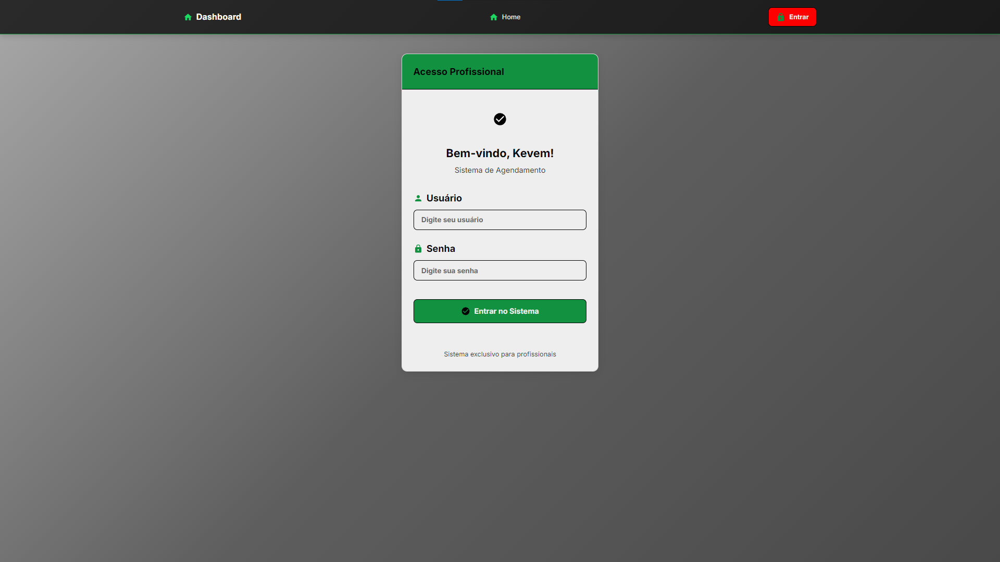
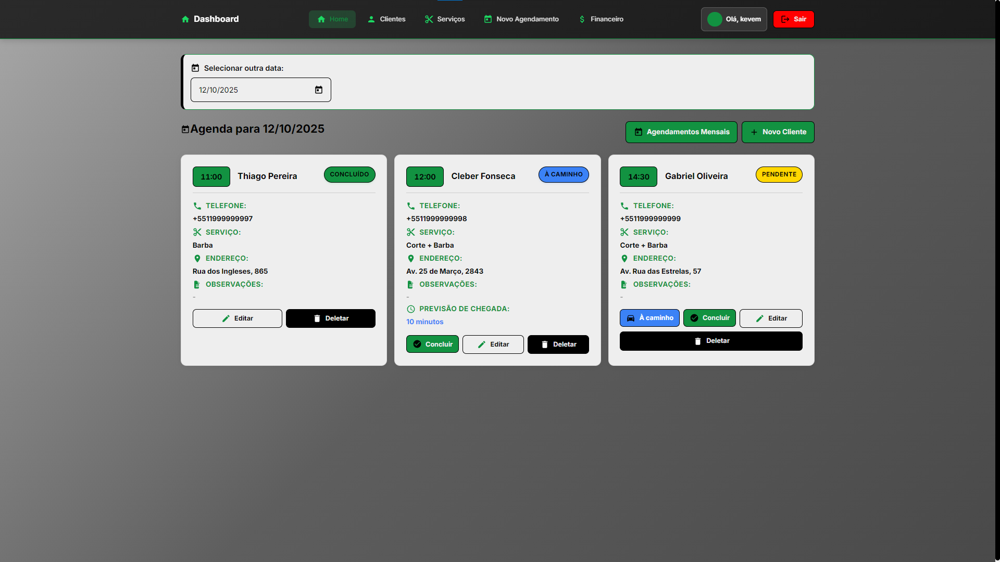
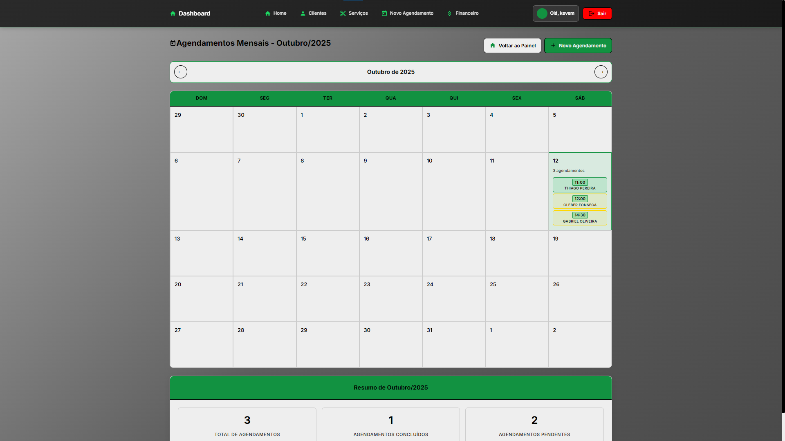
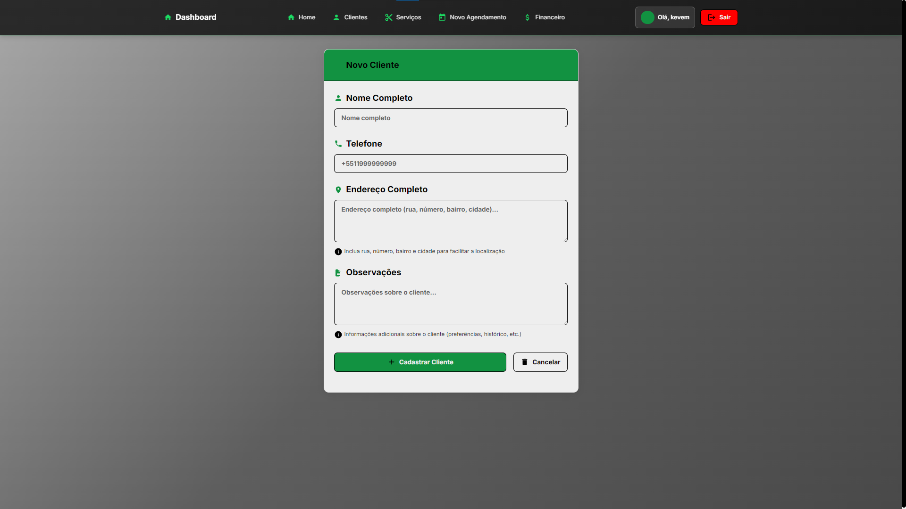
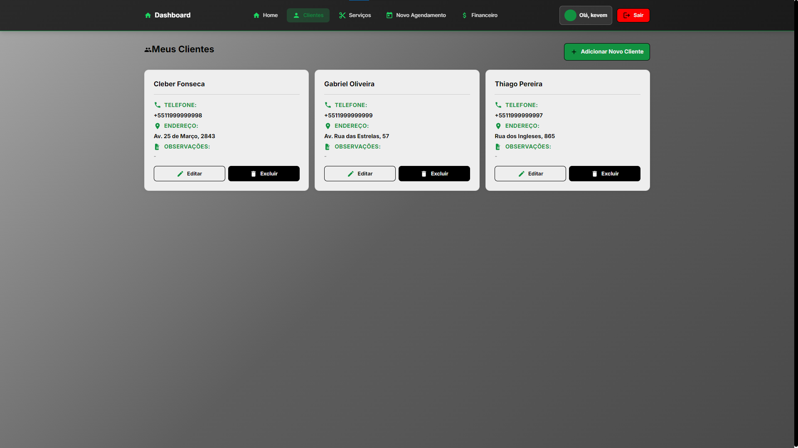
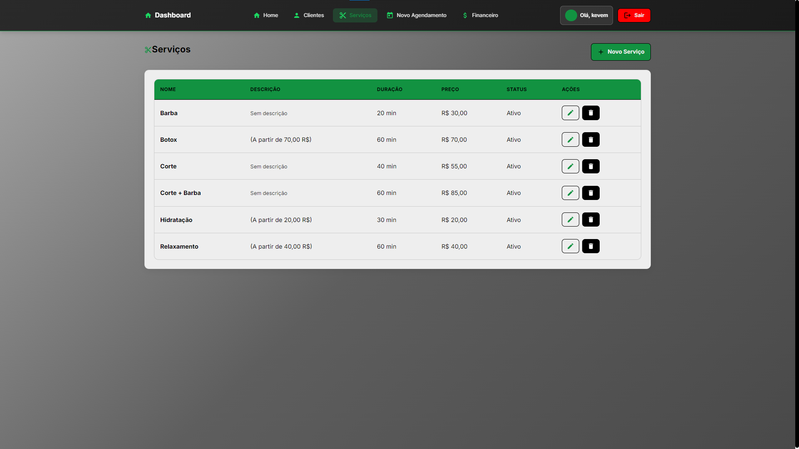
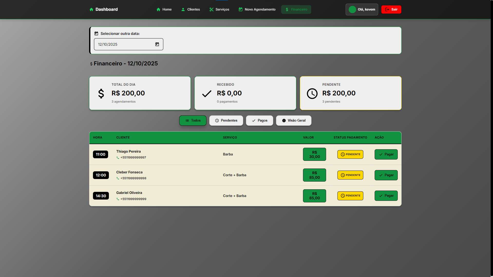
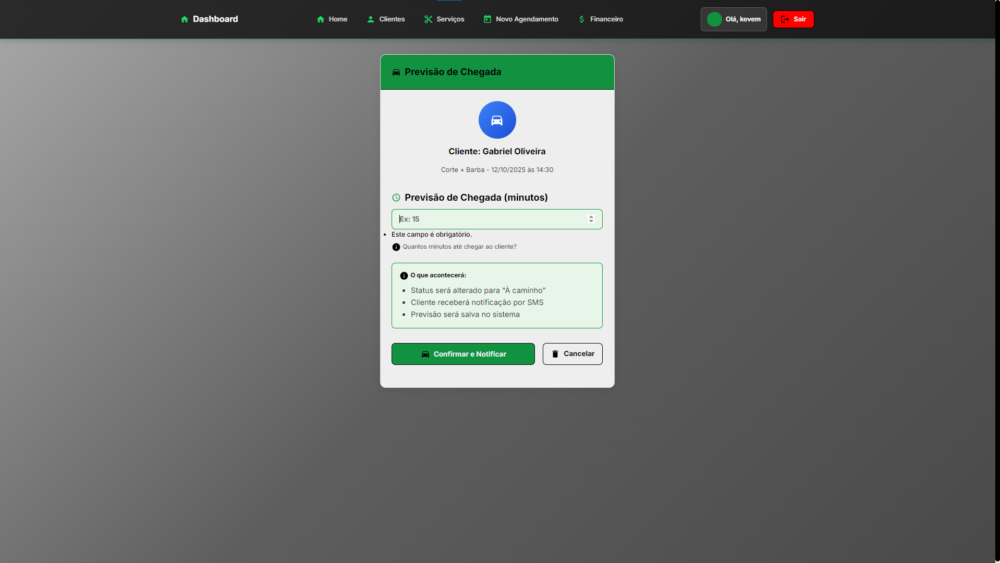
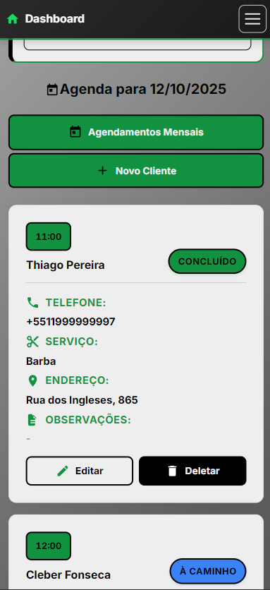

# 💇‍♂️ Sistema de Agendamento para Barbearia


> Sistema completo de gestão para barbearias desenvolvido em Django, com funcionalidades avançadas de agendamento, gestão de clientes, relatórios financeiros e notificações por SMS.

**🌐 [Ver em Produção](https://kevembarber.up.railway.app/)** | **📧 Contato:** doug.dev@hotmail.com

---

## 📋 Sobre o Projeto

Sistema profissional de agendamento e gestão desenvolvido para barbearias, permitindo controle completo de clientes, serviços, agendamentos e comunicação via SMS. Desenvolvido com foco em usabilidade, performance e escalabilidade.

### 🎯 Objetivo

Criar uma solução completa que modernize o atendimento de barbearias, automatizando processos manuais e melhorando a experiência tanto do barbeiro.

---

## ✨ Funcionalidades Principais

### 🎯 Gestão de Agendamentos
- Sistema completo de agendamento com calendário interativo
- Status em tempo real (Agendado, Confirmado, À caminho, Concluído)
- Previsão de chegada do barbeiro
- Histórico completo de atendimentos
- Filtros avançados por data, status e cliente

### 👥 Gestão de Clientes
- Cadastro completo com informações de contato e endereço
- Histórico de serviços realizados por cliente
- Busca e filtros avançados
- Visualização de dados consolidados

### 💼 Gestão de Serviços
- Cadastro de serviços oferecidos
- Definição de preços e tempo estimado
- Categorização de serviços
- Controle de serviços ativos/inativos

### 📱 Notificações por SMS
- Integração com SMSDev (API brasileira)
- Notificação automática "barbeiro a caminho"
- Previsão de chegada personalizada
- Logs detalhados de envio

### 📊 Relatórios Financeiros
- Dashboard com análise de faturamento mensal
- Relatórios por serviço
- Controle de status de pagamento
- Exportação de dados

### 🔐 Sistema de Autenticação
- Login seguro
- Controle de acesso baseado em permissões
- Sessões seguras com proteção CSRF

---

## 🚀 Tecnologias e Ferramentas

### Backend
- **Django 5.2.7** - Framework web Python
- **Python 3.12** - Linguagem de programação
- **PostgreSQL** - Banco de dados relacional
- **Gunicorn** - Servidor WSGI para produção

### Frontend
- **HTML5, CSS3, JavaScript** - Interface responsiva
- **Design moderno e intuitivo** - Focado em UX

### DevOps & Deploy
- **Docker & Docker Compose** - Containerização
- **Railway** - Plataforma de deploy
- **WhiteNoise** - Servir arquivos estáticos

### Integrações
- **SMSDev API** - Envio de SMS
- **Django Auth System** - Autenticação e autorização

### Qualidade & Testes
- **pytest** - Framework de testes
- **coverage.py** - Análise de cobertura (81%)
- **Factory Boy** - Criação de dados de teste
- **Bandit** - Análise de segurança
- **250 testes automatizados** cobrindo todas as funcionalidades

---

## 📸 Demonstração Visual

### Tela de Login

> Interface moderna e responsiva para acesso ao sistema

### Painel Principal (Dashboard)

> Visão geral dos agendamentos com calendário interativo

### Lista de Agendamentos

> Gerenciamento completo de agendamentos com filtros e status em tempo real

### Cadastro de Cliente

> Formulário completo para cadastro de novos clientes

### Lista de Clientes

> Visualização e busca de clientes cadastrados

### Gerenciamento de Serviços

> Cadastro e controle dos serviços oferecidos pela barbearia

### Relatório Financeiro

> Dashboard com análise de faturamento mensal

### Previsão de Chegada

> Sistema de notificação com previsão de chegada do barbeiro

### Interface Mobile

> Sistema totalmente responsivo para dispositivos móveis

---

## 🎯 Destaques Técnicos

### ✅ Qualidade de Código
- **250 testes automatizados** cobrindo todas as funcionalidades
- **81% de cobertura de código** com relatórios HTML
- **Análise de segurança** com Bandit
- **Código limpo e documentado**

### ✅ Arquitetura
- **Separação de responsabilidades** (Models, Views, Forms)
- **Design patterns** aplicados
- **Código escalável e manutenível**

### ✅ Performance
- **Consultas otimizadas** (evitando N+1 queries)
- **Testes de performance** implementados
- **Cache e compressão** configurados

### ✅ Segurança
- **40 testes de segurança** implementados
- **Proteção CSRF, XSS, SQL Injection**
- **Validação de dados** em todas as camadas
- **Headers de segurança** configurados

### ✅ DevOps
- **Containerização com Docker**
- **Deploy automatizado** via Railway
- **CI/CD configurado** (GitHub Actions)
- **Ambiente dev/prod** isolados

---

## 📊 Métricas do Projeto

- ✅ **250 testes automatizados**
- ✅ **81% de cobertura de código**
- ✅ **9 categorias de testes** (unitários, integração, segurança, performance, etc.)
- ✅ **Sistema em produção** e funcionando
- ✅ **100% responsivo** (mobile-first)
- ✅ **Integração com API externa** (SMSDev)

---

## 🌟 Sistema em Produção

O sistema está **hospedado e funcionando** em produção:

- **🌐 URL:** https://kevembarber.up.railway.app/
- **✅ Status:** Ativo e monitorado 24/7
- **🔒 SSL:** Certificado HTTPS ativo
- **⚡ Performance:** Otimizado com cache e compressão

### Características do Deploy:
- ✅ Deploy automático via Git
- ✅ Banco de dados PostgreSQL
- ✅ Arquivos estáticos otimizados
- ✅ Variáveis de ambiente seguras
- ✅ Logs centralizados
- ✅ Rollback rápido em caso de problemas

---

## 🛠️ Como Executar Localmente

### Pré-requisitos
- Docker Desktop instalado

### Passos Rápidos
```bash
# 1. Clone o repositório
git clone https://github.com/notdougz/projeto-barbeiro.git
cd projeto-barbeiro

# 2. Configure as variáveis de ambiente (opcional)
cp env_example.txt .env

# 3. Inicie os containers
docker-compose up --build

# 4. Acesse http://localhost:8000
```

Para mais detalhes técnicos, consulte a documentação do projeto.

---

## 📈 Melhorias Futuras Planejadas

- [ ] App mobile para clientes
- [ ] Integração com WhatsApp
- [ ] Sistema de avaliações
- [ ] Agendamento online para clientes
- [ ] Pagamento integrado (PIX, cartão)
- [ ] Dashboard analítico avançado

---

## 👨‍💻 Desenvolvedor

**Douglas Oliveira**


- 📧 **Email:** doug.dev@hotmail.com
- 💼 **LinkedIn:** [Douglas Oliveira](https://www.linkedin.com/in/douglas-oliveira-627088188/)
- 🐙 **GitHub:** [notdougz](https://github.com/notdougz)

---

## 📄 Licença

Este projeto está sob a licença MIT. Veja o arquivo [LICENSE](LICENSE) para mais detalhes.

---

